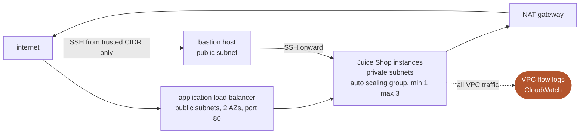

# Cloud Hardening Plan

Hardening an OWASP Juice Shop deployment on AWS: private subnets behind an application
load balancer, a bastion for admin access, scoped IAM, and VPC flow logs, all as
CloudFormation.


**[Full report (PDF)](report.pdf)** runs 36 pages, twenty findings with remediation and
console evidence. Submitted as the group final project for Cloud Security (ENPM665) at
the University of Maryland.

The starting point was a deliberately weak template from an earlier assessment: one EC2
instance in a public subnet, a flat security group open to `0.0.0.0/0` on 22, 80 and
443, no IAM role, no monitoring, database on the same box.

## Traffic path after hardening



## What changed

| | Before | After |
| --- | --- | --- |
| Exposure | Public IP, ports 22/80/3000 open to the world | No public IP; only the ALB is internet-facing, on 80 |
| Subnets | One public subnet, private one unused | Two public, two private, across two AZs |
| Access | SSH straight to the instance | Bastion in the public subnet, SSH onward from there |
| Identity | No role, long-lived keys | Instance profile with a read-only S3 policy |
| Compute | One instance | Auto scaling group, min 1 max 3, ALB health checks |
| Visibility | None | VPC flow logs for the whole VPC into CloudWatch |

## Requirements

- An AWS account, and a region with at least two availability zones
- An existing EC2 keypair for the bastion
- AWS CLI or the console to deploy the stack

## Usage

```bash
aws cloudformation deploy \
  --template-file cloudformation/juice-shop-hardened-fixed.yaml \
  --stack-name juice-shop-hardened \
  --capabilities CAPABILITY_IAM \
  --parameter-overrides KeyPairName=<your-keypair> TrustedSSHCidr=<your.ip>/32
```

The stack outputs the ALB DNS name; Juice Shop answers on port 80 there once the targets
pass their health check. Tear it down with `aws cloudformation delete-stack`, because the
NAT gateway and the ALB both bill by the hour.

Two templates are in `cloudformation/`:

- `juice-shop-hardened.yaml`, as submitted with the report
- `juice-shop-hardened-fixed.yaml`, the same architecture with the missing pieces filled
  in, and the one the command above deploys

## Results

From the testing documented in [the report](report.pdf):

| | |
| --- | --- |
| Findings closed in the template | 9 of 20 |
| Closed in the environment or by AWS defaults | 6 |
| Left as recommendations | 4 |
| Still open | 1, unrestricted egress |
| External nmap | Only tcp/80 answered; 22 and 3000 closed from outside |
| Reachability Analyzer | No path from the internet to a private instance |
| ALB targets | Healthy, HTTP 200, across two AZs |


- [Architecture](docs/architecture.md), subnets, traffic path, evidence
- [Findings](docs/findings.md), all twenty and what actually happened to each
- [Validation](docs/validation.md), how each control was tested
- [Template gaps](docs/template-gaps.md), where the submitted template and the report disagree

## Notes

The submitted template does not contain the routing the design depends on, with no route
tables and no NAT gateway, so as written it cannot reach the internet to install the
application and the health checks would never pass. The environment in the screenshots
was completed in the console. The corrected template closes that gap along with the
bastion's open SSH rule, IMDSv2, volume encryption and egress rules; it parses but has
not been deployed. Everything above is network and infrastructure hardening only. Juice
Shop's own vulnerabilities are untouched by design, and the ALB still terminates plain
HTTP, so nothing here is confidential in transit.
