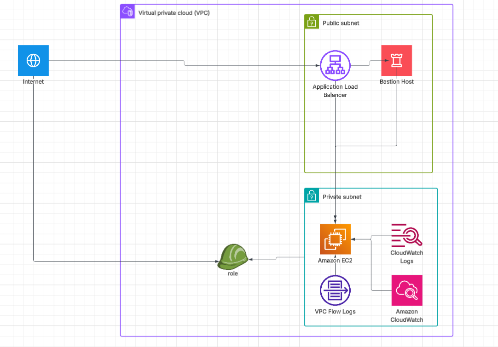
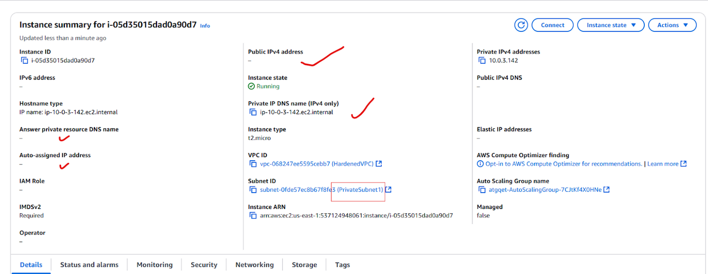
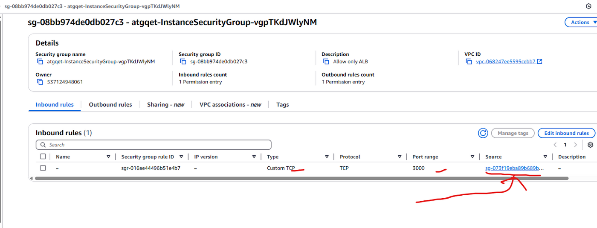
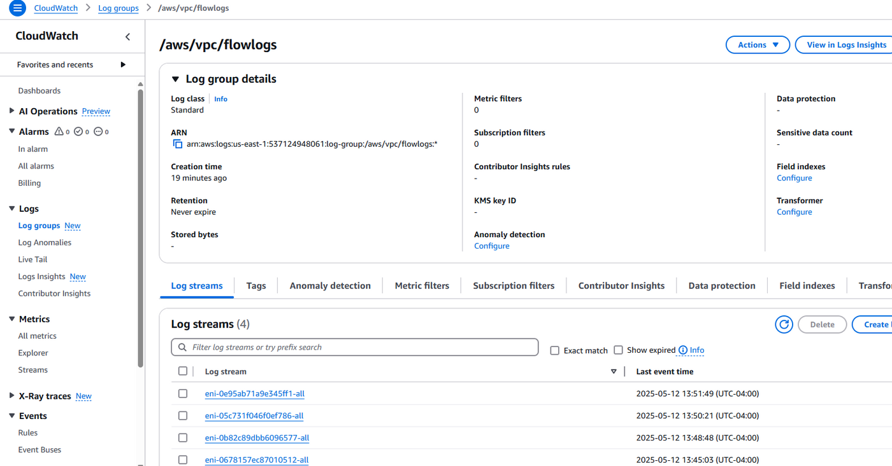

# architecture



one vpc, `10.0.0.0/16`, split four ways across two availability zones:

| subnet | cidr | holds |
| --- | --- | --- |
| PublicSubnet1 | 10.0.1.0/24 | alb, bastion host |
| PublicSubnet2 | 10.0.2.0/24 | alb (second az) |
| PrivateSubnet1 | 10.0.3.0/24 | juice shop instances |
| PrivateSubnet2 | 10.0.4.0/24 | juice shop instances (second az) |

## the traffic path

the internet reaches the alb on port 80 and nothing else. the alb forwards to the
target group on port 3000, into instances that have no public ip and sit in the
private subnets. that is enforced twice over — once by subnet placement, once by
the instance security group, which accepts 3000 only from the alb's security group
rather than from a cidr:

```yaml
InstanceSecurityGroup:
  SecurityGroupIngress:
    - IpProtocol: tcp
      FromPort: 3000
      ToPort: 3000
      SourceSecurityGroupId: !Ref ALBSecurityGroup
```

security-group references beat cidr ranges here: the rule keeps holding as instances
are replaced by the asg and addresses change.

administrative access runs through the bastion in the public subnet, then onward by
ssh to the private instances. the app instances are never addressable from outside.

## compute

an auto scaling group across both private subnets, min 1 / max 3, fed by a launch
template that installs juice shop from source in userdata. the instance profile
carries a read-only s3 role, so nothing on the box needs long-lived access keys.

## monitoring

vpc flow logs for the whole vpc, all traffic, into cloudwatch logs. the report also
describes guardduty and cloudwatch alarms, enabled at the account level rather than
in the template.

## the evidence

an app instance, running in `PrivateSubnet1` with no public ipv4 and imdsv2 required:



subnet layout across the two azs:



the instance role attached, replacing the long-lived keys the baseline needed:



## caveat

this describes the environment as deployed and screenshotted. the submitted
template is missing the routing that makes it work — no route tables, no nat.
[template-gaps.md](template-gaps.md) covers what is and is not in the file.
