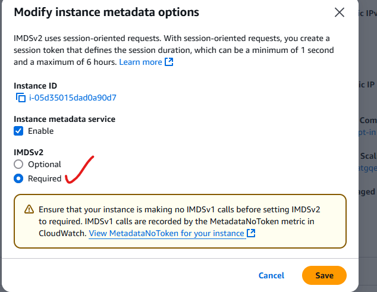

# midterm findings and what happened to each

twenty findings came out of the midterm assessment of the baseline juice shop
deployment. the hardening plan addresses them in three ways, and the report is
explicit about which is which — several are recommendations rather than
implemented controls, and they are marked as such below.

**fixed in the template** — the change is in `juice-shop-hardened.yaml`.
**fixed in the environment** — applied in the console or inherited from an aws
default; visible in the appendix screenshots, not in iac.
**recommended** — named as the right fix, not carried out.

| # | finding | status | how |
| --- | --- | --- | --- |
| 1 | imdsv1 metadata service unrestricted | environment | al2023 launches with imdsv2 required; the console confirms it. not set in the template |
| 2 | privilege escalation via over-permissive iam | template | no broad role attached; a scoped read-only policy instead |
| 3 | hardcoded root password | recommended | secrets manager, or parameterise |
| 4 | directory permissions 755 | environment | `chmod -R 700 /opt/juice-shop/data` |
| 5 | no encryption at rest | environment | ebs default encryption at the account level |
| 6 | outdated crypto-js | environment | `npm install` pulls current at build |
| 7 | xxe in libxmljs2 | environment | same — current version at install |
| 9 | ssh port 22 open to the world | partial | app moved to a private subnet with no public ip, admin access via a bastion. **the bastion's own group still allows 22 from `0.0.0.0/0`** — see [template-gaps](template-gaps.md) |
| 10 | kernel and jinja2 cves | environment | `yum update -y` in userdata |
| 11 | no patch management | recommended | ssm patch manager |
| 12 | juice shop and mariadb on one instance | recommended | move the database to rds |
| 13 | orphaned private subnet | template | both private subnets now carry the asg |
| 14 | no monitoring | template | vpc flow logs to cloudwatch |
| 15 | app on port 3000 publicly exposed | template | alb in front, 3000 reachable only from the alb group |
| 16 | no iam role on the instance | template | instance profile with a scoped role |
| 17 | unrestricted egress | open | listed with no remediation; the template sets no egress rules |
| 18 | no az redundancy | template | subnets and alb span two azs |
| 19 | no backups | recommended | ebs snapshot automation, rds for the database |
| 20 | no health checks | template | target group health check on `/` |

finding 8 is not present in the report's numbering.

finding 1 is a good illustration of the environment/template split. imdsv2 was set
to *required* through the console dialog below, on an instance that already had it
by ami default — the launch template never asks for it, so a fresh stack inherits
whatever the ami and account happen to do:

## the shape of it

nine of twenty are genuinely closed in the template. the interesting ones are the
partials: finding 9 moved the workload out of reach but left the front door of the
bastion open, and finding 17 never got a remediation written at all. those two are
the honest weak points of the submission, and they are the first things the
corrected template addresses.
