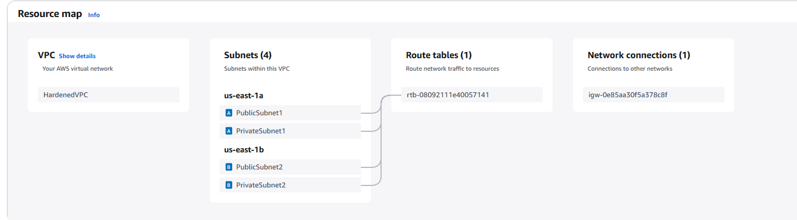
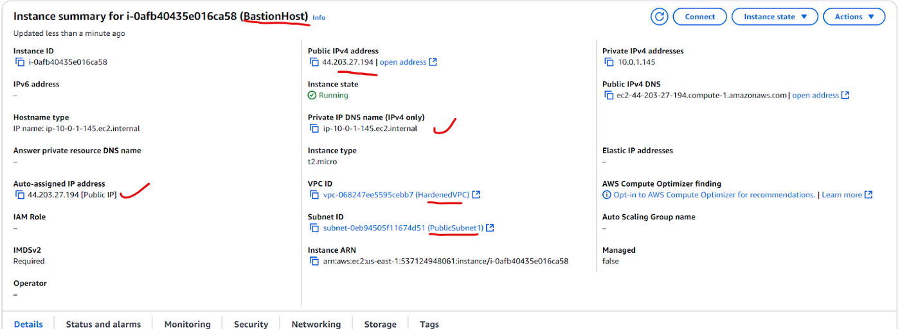

# validation and testing

each control was tested from the outside, not just read back from the console.

## private placement

- ec2 console shows the instance with no public ipv4 and a `10.0.3.x` address
- reached it over ssh through the bastion, then `ping 8.8.8.8` and `curl` from the
  instance to prove outbound worked while inbound did not
- vpc flow logs captured the outbound traffic

## the alb is the only way in

- opened the alb dns in a browser and got juice shop
- confirmed the instance itself was not reachable directly
- target group health status healthy, http 200



## security group rules

nmap from an external address: only port 80 answered. 22 and 3000 were closed from
outside the vpc. the console rules were then read back to confirm the only
`0.0.0.0/0` ingress in the environment was tcp/80 on the alb group:

```bash
aws ec2 describe-security-groups --group-ids sg-xxxxxxxx \
  --query "SecurityGroups[*].IpPermissions[*].[IpProtocol,FromPort,ToPort,IpRanges]" \
  --output table
```



## public ip restriction

- vpc reachability analyzer, simulating a path from the internet to a private
  instance — no path, as intended
- curl and wget from an instance in the public subnet directly to the private
  instance: refused, except through the alb dns

```bash
aws ec2 describe-subnets --subnet-ids subnet-xxxxxx \
  --query "Subnets[*].MapPublicIpOnLaunch"
```

## load behaviour

simultaneous requests against the alb dns returned consistently, distributed across
healthy targets, with health checks holding at http 200 throughout.

## what this does not cover

the nmap sweep is the strongest single piece of evidence here, and it was run once,
from one external address, against the environment as it stood that day. nothing
tests the application itself — juice shop is deliberately full of injection and xss
bugs, and none of that is touched by network hardening. the report names a waf as
the answer and does not claim otherwise.

the bastion group's open ssh rule did not show up in this testing because nmap was
pointed at the alb, not at the bastion's own public address.
